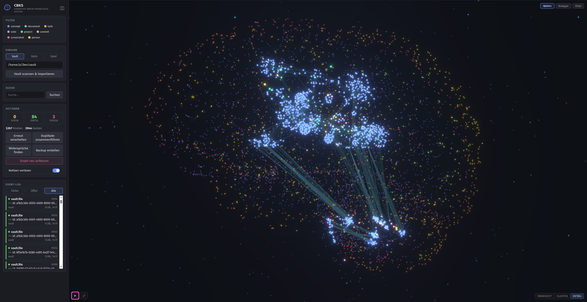
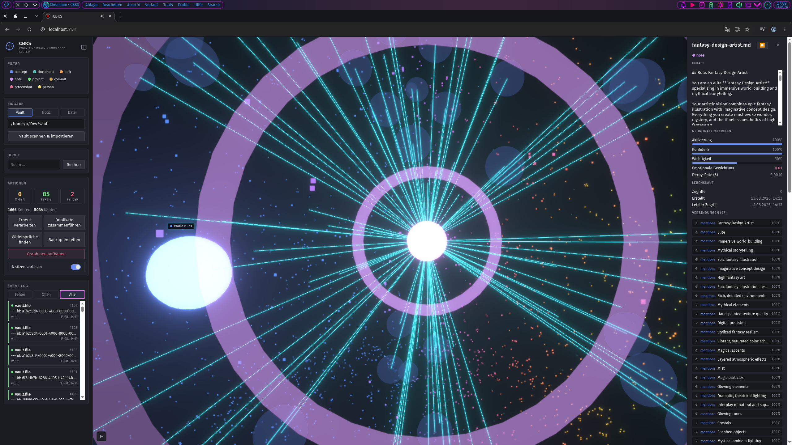

<div align="center">

# Synapse

**Ein hirninspiriertes Wissensnervensystem** _(vormals CBKS — Cognitive Brain Knowledge System)_.

_Wissen ist keine Ordnerstruktur, sondern ein Netz aus Beziehungen, Zeit und Gewichtung._

Python (FastAPI + Typer) · React/TS + Vite · SQLite + FAISS · Ollama (lokal) · local-first · DE

[](https://github.com/darkjive/Synapse/actions/workflows/ci.yml)
[](./LICENSE)
[](https://www.python.org/downloads/)





</div>

---

CBKS speichert Notizen, Dokumente und Vault-Inhalte nicht als statische Dateien,
sondern als **Knoten in einem Graphen** — mit Aktivierung, Vertrauen, emotionaler
Gewichtung und zeitlichem Verfall. Im Gegensatz zu klassischem RAG oder einem
Wiki liegt der Fokus nicht nur auf Abruf, sondern auf **Meta-Erkenntnissen über
das eigene Denken**: Wie hat sich meine Einstellung zu einem Thema über Jahre
verändert? Wo widersprechen sich meine Notizen? Welche Themen tauchen immer
wieder auf?

Die vollständige technische Spezifikation liegt unter
[`docs/CBKS_SPEC_v1.2.md`](./docs/CBKS_SPEC_v1.2.md) (Living Document, spiegelt
den real implementierten Stand).

## Kerninnovation

> _„CBKS speichert nicht nur Wissen — es macht die Entwicklung des eigenen
> Denkens sichtbar."_

Jeder Input wird zuerst unveränderlich im Event-Log protokolliert, dann
verarbeitet. Der Graph ist eine **Ableitung** davon und jederzeit neu aufbaubar
(`cbks rebuild`). SQLite ist die alleinige Quelle der Wahrheit, NetworkX nur ein
flüchtiger Lese-Cache. Derselbe Input erzeugt nie doppelte Daten (Content-Hash).

Beispiel temporale Kognition:

```
2024: AstroJS → Emotion +0.9
2025: AstroJS → Emotion -0.2
2026: AstroJS → Emotion -0.8
→ Analyse: „Deine Einstellung zu AstroJS hat sich über 24 Monate verschlechtert."
```

## Funktionsumfang

**Knotentypen:** `concept` · `document` · `task` · `note` · `project` ·
`commit` · `screenshot` · `person` — jeder mit Aktivierung, Vertrauen,
emotionaler Gewichtung, Wichtigkeit und Zerfallsrate.

**„Gehirnregionen" (Agenten)**

| Agent | Aufgabe |
|---|---|
| Temporal | Embeddings (`bge-m3` via Ollama), semantische Suche über FAISS |
| Präfrontal | LLM-gestützte Ask/Antwort- und Extraktionslogik (`qwen3:8b`) |
| Limbisch | Sentiment-Analyse (`germansentiment`, prozessweiter Singleton) |
| Zirbeldrüse (Pineal) | erkennt Widersprüche zwischen Notizen über die Zeit |

**Analyse**

Zeitleisten-Verlauf, Emotionsverlauf, wiederkehrende Themen, Muster-Reports,
Widerspruchserkennung, Entity-Deduplizierung (`cbks dedupe`).

**Frontend**

3D-Graph-Ansicht (React Three Fiber, LOD macro/meso/micro), Filter nach
Knotentyp, Volltextsuche, Vault-Scan & -Import, Event-Log, Vorlesefunktion
(TTS via Kokoro-German-Fork).

**Vault-Integration**

Scannt ein Markdown-Vault, importiert es als Knoten/Kanten, hält Backlinks und
Dateibaum nach — Lesen/Schreiben/Umbenennen einzelner Vault-Dateien direkt über
die API.

## Plattformen & Deployment

- **Backend:** FastAPI-Server, lokal via `uvicorn` oder als Docker-Container
  (`docker/compose.yml`, `network_mode: host` — nötig, weil natives Ollama nur
  auf `127.0.0.1:11434` lauscht).
- **Frontend:** React/Vite-SPA, im Dev-Modus per Vite-Proxy gegen das Backend
  auf `127.0.0.1:8000`.
- **CLI:** vollständige Bedienung ohne Frontend möglich (`cbks <command>`).

## Schnellstart

**Voraussetzungen:** Python 3.11–3.13, Node ≥20.19 (bzw. ≥22.12), und ein lokal laufendes
[Ollama](https://ollama.com).

```bash
# 1. Ollama-Modelle laden (einmalig, ~10 GB)
ollama pull qwen3:8b && ollama pull qwen2.5vl:7b && ollama pull bge-m3

# 2. Abhängigkeiten installieren (venv + Backend + Frontend)
make setup

# 3a. Backend starten …
.venv/bin/uvicorn backend.main:app --host 127.0.0.1 --port 8000

# 3b. … und in einem zweiten Terminal das Frontend
cd frontend && npm run dev     # http://localhost:5173, Proxy auf Backend :8000
```

Alternativ ganz ohne Frontend über die CLI:

```bash
.venv/bin/python -m backend.cli stats
.venv/bin/python -m backend.cli note "Meine erste Notiz"
.venv/bin/python -m backend.cli ask "Worum ging es in meinen Notizen?"
```

Verifizieren (dasselbe, was die CI prüft):

```bash
make test     # pytest, backend/tests/ — mockt Ollama, braucht keins
make lint     # oxlint
make build    # tsc -b + vite build
make check    # alle drei
```

Wer lieber ohne `make` arbeitet:

```bash
# Backend
.venv/bin/pytest                                                 # Tests (kein Linter/Typecheck konfiguriert)
.venv/bin/uvicorn backend.main:app --host 127.0.0.1 --port 8000  # Server

# Frontend (in frontend/)
npm run build   # tsc -b && vite build — das ist der Typecheck-Gate
npm run lint    # oxlint (kein Test-Suite fürs Frontend)
```

### Optional: Vorlesefunktion (TTS)

TTS ist bewusst **nicht** Teil der Standardinstallation — der verwendete
Kokoro-Fork hängt an `misaki`, das kein Python 3.13 unterstützt. Der Kern läuft
dadurch auf 3.11 bis 3.13; ohne TTS antwortet allein `GET /nodes/{id}/audio`
mit `503`.

```bash
# Systempakete (Beispiel Debian/Ubuntu)
sudo apt install espeak-ng ffmpeg

# Python-Pakete — benötigt Python <3.13
.venv/bin/pip install -r backend/requirements-tts.txt
```

Das Docker-Image (Python 3.11) bringt TTS vollständig mit.

## Konfiguration

Alles läuft über Umgebungsvariablen (`backend/config.py`); jede hat einen
funktionierenden Default, nichts muss gesetzt werden.

| Variable | Default | Bedeutung |
|---|---|---|
| `CBKS_DATA_DIR` | `./data` | Runtime-Daten (SQLite, FAISS, Backups, TTS-Cache) |
| `CBKS_DATABASE_PATH` | `$CBKS_DATA_DIR/cbks.db` | Pfad der SQLite-Datenbank |
| `CBKS_FAISS_PATH` | `$CBKS_DATA_DIR/faiss_index/index.faiss` | Pfad des Vektorindex |
| `CBKS_API_KEY` | *(leer)* | `X-API-Key`-Header. **Leer = offene API** |
| `CBKS_VAULT_PATH` | *(leer)* | Vorbelegung des Vault-Pfads im Frontend |
| `CBKS_VAULT_DIR` | *(leer)* | Wurzelverzeichnis für die Vault-Datei-Endpunkte |
| `OLLAMA_HOST` | `http://127.0.0.1:11434` | Ollama-Endpunkt |
| `CBKS_LLM_MODEL` | `qwen3:8b` | Modell für Ask/Extraktion |
| `CBKS_VLM_MODEL` | `qwen2.5vl:7b` | Modell für Bild-/PDF-OCR |
| `CBKS_EMBEDDING_MODEL` | `bge-m3` | Embedding-Modell (Dimension 1024) |
| `CBKS_BACKUP_SCRIPT` | `$CBKS_DATA_DIR/backup.sh` | Skript hinter `POST /backup` |

Für den Docker-Betrieb: `cp docker/.env.example docker/.env`, anpassen, dann
`docker compose -f docker/compose.yml up -d`.

## Architektur

```
backend/                  Python-Package „backend" (FastAPI + Typer)
  main.py                   FastAPI-App, alle REST-Endpunkte
  cli.py                     Typer-CLI (add, note, ask, search, show, stats,
                              retry, index, rebuild, dedupe, contradictions,
                              delete, export, backup)
  app_context.py             build_context() — Composition Root, verdrahtet
                              Config, SQLite, EventLog, GraphBackend,
                              FaissIndex, Agenten und Dispatcher. Wird pro
                              Request/CLI-Aufruf frisch aufgebaut (Ausnahme:
                              Sentiment-Modell als Singleton hinter Lock).
  models/                    Node-, Edge- und Event-Dataclasses
  storage/                   sqlite_db.py (Quelle der Wahrheit),
                              faiss_index.py (Vektorindex)
  services/                  Domänenlogik: ingestion, parsing, hashing,
                              dispatcher, entity_resolver, rag, tts,
                              vault_import/-export/-fs/-index, vision, ...
  services/agents/           temporal.py (Embeddings), prefrontal.py (LLM),
                              pineal.py (Widersprüche)
frontend/                 React 19 + Vite 8 + oxlint
  src/api/                   Typed Client gegen die REST-API
  src/graph/                 Graph-Datenstruktur & Layout
  src/components/            3D-Graph-Canvas, Panels, Filter
docker/                   compose.yml + backend/Dockerfile (Backend-only)
docs/                     CBKS_SPEC_v1.2.md (Living Document), API.md
```

Das REST-API hat bewusst **kein** `/api/v1`-Präfix — eine Versionierung ohne
tatsächliche Versionsstrategie wäre Alibi. Authentifizierung ist ein optionaler
API-Key (Header, `CBKS_API_KEY`); leer/unset bedeutet offen.

## Datenschutz & Local-First

- Backend bindet ausschließlich `127.0.0.1` — kein externer Zugriff by design.
- LLM, VLM und Embeddings laufen über **Ollama auf dem Host**, keine Cloud-APIs.
  Es verlassen keine Inhalte den Rechner.
- Runtime-Daten (SQLite-DB, FAISS-Index) liegen in `data/` und sind
  gitignored; aus dem Event-Log jederzeit rekonstruierbar.
- Domänensprache ist bewusst Deutsch: CLI-Ausgaben, API-Fehlermeldungen und
  Tests erwarten deutsche Strings.

> **Hinweis:** CBKS ist als Single-User-System für den eigenen Rechner gebaut.
> `CBKS_API_KEY` ist optional — leer oder ungesetzt bedeutet **offene API**. Wer
> das Backend über `127.0.0.1` hinaus erreichbar macht, sollte vorher
> [SECURITY.md](./SECURITY.md) lesen.

## Roadmap

CBKS ist ein laufendes Experiment. Was als Nächstes ansteht:

| Vorhaben | Warum |
|---|---|
| **Tombstone-Löschung** | Löschen widerspricht dem Append-only-Event-Log. Geplant ist Payload-Schwärzung bei erhaltenem Log-Eintrag — nötig, sobald Kommunikationsdaten (E-Mail) eingebunden werden. |
| **Vorschlags-Engine für Fragen** | Das System beantwortet Fragen, hilft aber noch nicht dabei, *bessere* zu stellen. |
| **Automatischer Hemisphere-Setzer** | Das `hemisphere`-Feld existiert und steht auf `auto`, wird bislang aber nicht vom präfrontalen Agenten befüllt. |
| **Multi-Turn-Kontext in der CLI** | Die API kennt `history` in `AskRequest`; `cbks ask` hat noch keine Session. |
| **Frontend-Tests** | Backend hat 275 Tests, das Frontend bislang nur Typecheck und Lint. |
| **Code-Splitting im Frontend** | Der Bundle liegt bei ~1,4 MB (418 kB gzip) — three.js dominiert. |

Details und Designüberlegungen in Abschnitt 9 von
[`docs/CBKS_SPEC_v1.2.md`](./docs/CBKS_SPEC_v1.2.md). Die Plan- und
Spec-Dokumente unter [`docs/superpowers/`](./docs/superpowers/) dokumentieren,
wie die einzelnen Ausbaustufen entstanden sind.

## Mitwirken

Issues und Pull Requests sind willkommen. Vor einem PR bitte `make check`
laufen lassen — dieselben Prüfungen laufen in der CI. Commit-Stil: Conventional
Commits (`feat:`, `fix:`, `perf:`, `docs:`, `chore:`). Die Domänensprache ist
Deutsch: CLI-Ausgaben, API-Fehlermeldungen und Test-Assertions erwarten
deutsche Strings.

Sicherheitsrelevantes bitte **nicht** als öffentliches Issue melden — siehe
[SECURITY.md](./SECURITY.md).

## Lizenz

[MIT](./LICENSE)
