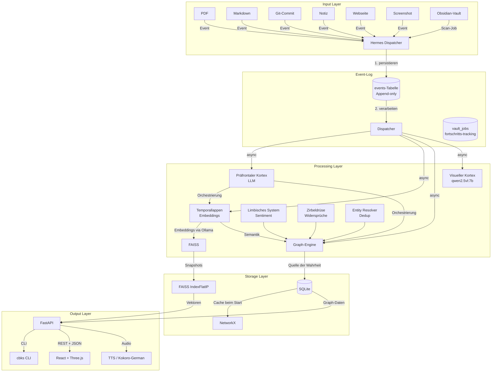
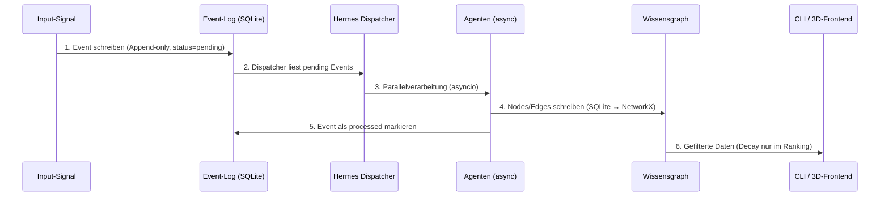
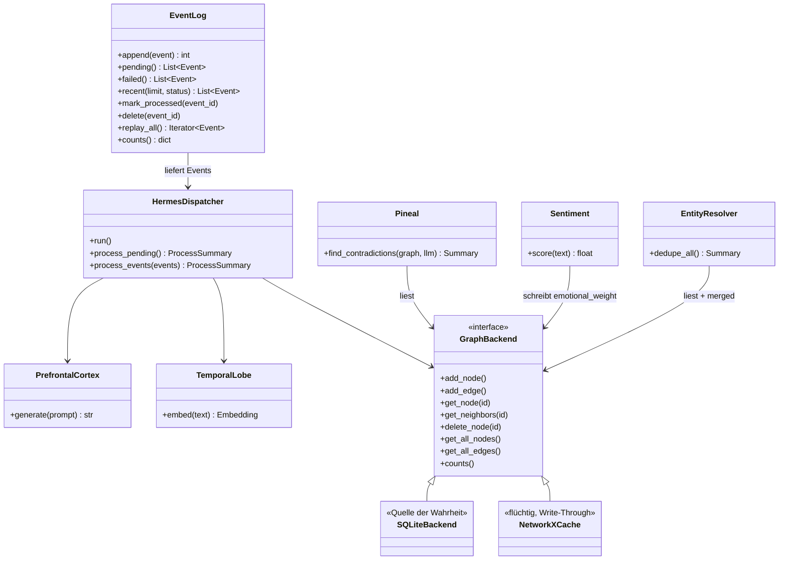

# CBKS – Technical Specification v1.2
**Request for Comments (RFC) | Stand: Juli 2026**

**Autor:** Al Ain
**Hardware:** AMD Ryzen 9 5900X · AMD Radeon RX 6900 XT (16 GB VRAM) · 32 GB RAM
**Betriebssystem:** Garuda Linux (Rolling Release)
**Status:** Living Document – v1.2 speichert den *real implementierten* Stand.

---

## Änderungen gegenüber v1.1

v1.1 war ein Design-Entwurf. v1.2 spiegelt wider, was **wirklich gebaut wurde**.

| Nr. | Änderung | Grund |
|-----|----------|-------|
| 1 | `NodeType` um `"person"` ergänzt | Implementiert in `backend/models/nodes.py`, Frontend `frontend/src/api/types.ts` |
| 2 | CLI hat jetzt 12 Befehle (statt 9) | `dedupe`, `contradictions`, `delete` sind hinzugekommen |
| 3 | REST-API hat **kein** `/api/v1`-Präfix | Endpunkte liegen direkt an der Wurzel; Präfix wäre ohne Versionierung Alibi |
| 4 | Authentifizierung: optionaler API-Key (Header), **keine** Basic Auth | `backend/auth.py:require_api_key`, an App via `Depends` gekoppelt; leerer/fehlender Key = offen |
| 5 | REST-API an tatsächliche Endpunkte angepasst | Siehe Abschnitt 5.2 |
| 6 | `Limbisches System` als **implementiert** markiert | `backend/services/sentiment.py` (prozessweiter Singleton, Lock) |
| 7 | `Zirbeldrüse` als **implementiert** markiert | `backend/services/agents/pineal.py` via lokales LLM |
| 8 | Entity Resolution als **implementiert** markiert | `backend/services/entity_resolver.py` + `cbks dedupe` CLI + `POST /dedupe` |
| 9 | Frontend: **3D** ist Standard (React Three Fiber), nicht „Phase 3, D3.js 2D" | `frontend/src/components/GraphCanvas.tsx`, LOD macro/meso/micro |
| 10 | Docker: **backend-only** mit `network_mode: host`, kein Ollama-Container | Host-Ollama lauscht auf 127.0.0.1:11434, Bridge-Netz würde das nicht erreichen |
| 11 | `requirements.txt` an echte installierte Versionen angepasst | fastapi 0.139.0, uvicorn 0.50.0, pydantic 2.13.4, faiss-cpu 1.14.3 etc. |
| 12 | **TTS** via Kokoro-German-Fork dokumentiert | `backend/services/tts.py`, `GET /nodes/{id}/audio`; braucht `espeak-ng` + `ffmpeg` |
| 13 | **Vault-Import** dokumentiert | `backend/services/vault_import.py`, `/vault/*`-Endpunkte, `vault_jobs`-Tabelle |
| 14 | **`concept_title_vectors`**-Tabelle dokumentiert | `backend/storage/sqlite_db.py:57-60`, für Concept-Dedup |
| 15 | **`hemisphere`-Feld** am Node eingeführt (Default `"auto"`) | Explizite Gehirnhälften-Zuweisung statt Starrheit des `type`-Mappings; siehe Abschnitt 4.6 |

---

## Inhaltsverzeichnis

1. [Executive Summary](#1-executive-summary)
2. [Architekturübersicht](#2-architekturübersicht)
3. [Systemkomponenten](#3-systemkomponenten)
4. [Datenmodell](#4-datenmodell)
5. [API-Definitionen](#5-api-definitionen)
6. [Infrastruktur & Deployment](#6-infrastruktur--deployment)
7. [Hardware-Validierung](#7-hardware-validierung)
8. [Implementierungsroadmap](#8-implementierungsroadmap)
9. [Bekannte Lücken](#9-bekannte-lücken)
10. [Anhänge](#10-anhänge)

---

## 1. Executive Summary

### 1.1 Vision

**CBKS (Cognitive Brain Knowledge System)** ist ein **hirninspiriertes Wissensnervensystem**, das Informationen nicht in statischen Ordnerstrukturen, sondern in **dynamischen Beziehungen, zeitlichen Mustern und emotionalen Gewichten** organisiert.

Im Gegensatz zu klassischen RAG (Retrieval-Augmented Generation)-Systemen oder Wikis liegt der Fokus auf:

- **Meta-Erkenntnissen** (Widersprüche über Jahre, Frustrationskurven, Themencluster)
- **Temporaler Kognition** (Entwicklung des eigenen Denkens analysieren)
- **Neuronalen Metadaten** (Aktivierung, Vertrauen, emotionale Gewichtung)

### 1.2 Kerninnovation

> *„CBKS speichert nicht nur Wissen – es macht die Entwicklung des eigenen Denkens sichtbar."*

**Beispiel Temporale Kognition:**

```
2024: AstroJS → Emotion +0.9
2025: AstroJS → Emotion -0.2
2026: AstroJS → Emotion -0.8
→ Analyse: „Deine Einstellung zu AstroJS hat sich über 24 Monate kontinierlich verschlechtert."
```

### 1.3 Architekturprinzipien

1. **Event-Sourcing light:** Jeder Input wird zuerst unveränderlich protokolliert, dann verarbeitet. Der Graph ist eine *Ableitung* des Event-Logs und kann jederzeit neu aufgebaut werden.
2. **Eine Quelle der Wahrheit:** SQLite hält den persistenten Zustand. NetworkX ist ein flüchtiger Lese-Cache.
3. **Idempotenz:** Derselbe Input erzeugt niemals doppelte Daten (Inhalts-Hash).
4. **Kein Datenverlust durch Design:** Decay wirkt nur auf Darstellung und Ranking, niemals auf Speicherung. Backups ab Tag 1.
5. **CLI zuerst:** Das System ist ohne Frontend vollständig nutzbar.
6. **Lokal zuerst (local-first):** Backend bindet `127.0.0.1`; Vite-Proxy erwartet Backend dort. Ollama läuft nativ auf dem Host. Keine Roundtrips zu externen APIs.
7. **Living Spec:** Diese Spezifikation wird bei jeder relevanten Code-Änderung nachgezogen. Code und Spec gelten als verwaist, wenn sie länger als ein Release auseinanderlaufen.

---

## 2. Architekturübersicht

### 2.1 High-Level-Diagramm



### 2.2 Datenfluss mit persistentem Event-Log



**Absturzverhalten:** Beim Neustart liest der Dispatcher alle Events mit `status = 'pending'` erneut ein. Vault-Scan-Jobs mit `done = 0` werden beim Lifespan-Start abgebrochen (`abort_unfinished_jobs`).

**Replay:** `cbks rebuild` leert Graph + FAISS-Index und spielt das gesamte Event-Log neu ab – z. B. nach einer Datenmodell-Änderung oder einem Embedding-Modell-Wechsel.

---

## 3. Systemkomponenten

### 3.1 Komponentendiagramm



### 3.2 Konsistenzregel SQLite ↔ NetworkX

- **SQLite ist die alleinige Quelle der Wahrheit.**
- NetworkX (`DiGraph`) wird **beim Start** vollständig aus SQLite geladen.
- Jeder Schreibzugriff läuft **Write-Through**: erst SQLite (in einer Transaktion), dann NetworkX. Schlägt SQLite fehl, wird NetworkX nicht angefasst.
- Bei Inkonsistenz-Verdacht: Neustart lädt den Cache frisch – kein manueller Abgleich nötig.

### 3.3 Agenten-Übersicht

| Hirnareal | Funktion | Status | Technische Umsetzung |
|---|---|---|---|
| Präfrontaler Kortex | Ziele, Aufgaben, Orchestrierung, RAG | ✅ aktiv | Qwen3:8b via Ollama (`qwen3:8b`) |
| Temporallappen | RAG, Embeddings, semantische Suche | ✅ aktiv | FAISS `IndexFlatIP` + bge-m3 via Ollama |
| Graph-Engine | Beziehungen & Wissensnetzwerk | ✅ aktiv | SQLite + NetworkX (Write-Through) |
| Visueller Kortex | Screenshot-/Bild-Verständnis | ✅ aktiv | `qwen2.5vl:7b` via Ollama |
| Limbisches System | Sentiment- & Frustrationsanalyse | ✅ aktiv | `backend/services/sentiment.py` (lokales Modell, prozessweiter Singleton mit Lock) |
| Zirbeldrüse | Metakognition, Widersprüche | ✅ aktiv | `backend/services/agents/pineal.py` via lokales LLM |
| Entity Resolver | Konzept-Dedup | ✅ aktiv | `backend/services/entity_resolver.py` + `concept_title_vectors`-Tabelle |
| TTS | Vorlesen von Node-Inhalten (deutsch) | ✅ aktiv | `backend/services/tts.py` Kokoro-German-Fork + `espeak-ng` |

### 3.4 Modellwahl: Benchmark statt Bauchgefühl

Vor Festlegung auf Qwen3-14B wurden **5 echte Beispiel-Events** (1 PDF, 1 Git-Commit, 1 Notiz, 1 Webseite, 1 Screenshot-Beschreibung) gegen drei Modellgrößen getestet.

**Entschieden:** `qwen3:8b` (Favorit aus dem Benchmark) als LLM und `qwen2.5vl:7b` als VLM. Embeddings: `bge-m3` (Dim 1024).

`scripts/benchmark_models.py` ist ein manuelles Tool mit `tests/fixtures/benchmark_events.json`, kein Teil der CI.

| Modell | VRAM ca. | Rolle |
|---|---|---|
| Qwen3-8B-q4 | ~5–6 GB | Dauerhaft geladen, LLM |
| bge-m3 | ~1–2 GB | Dauerhaft geladen, Embeddings |
| Qwen2.5-VL-7B-q4 | ~5–6 GB | Lazy, nur bei Screenshot/ Bild-Event |

---

## 4. Datenmodell

### 4.1 Event-Log

Die zentrale Tabelle. Alles andere ist daraus ableitbar.

```sql
CREATE TABLE events (
    id           INTEGER PRIMARY KEY AUTOINCREMENT,
    event_type   TEXT NOT NULL,           -- 'document.added', 'note.created', 'commit.ingested', ...
    content_hash TEXT NOT NULL,           -- SHA-256 des Roh-Inhalts (Idempotenz)
    payload      TEXT NOT NULL,           -- JSON: Rohdaten oder Pfad zur Quelldatei
    source       TEXT,                    -- 'cli', 'watcher', 'api'
    status       TEXT NOT NULL DEFAULT 'pending',  -- 'pending' | 'processed' | 'failed'
    error        TEXT,                    -- Fehlermeldung bei status='failed'
    created_at   TEXT NOT NULL DEFAULT (strftime('%Y-%m-%dT%H:%M:%fZ', 'now')),
    processed_at TEXT
);

CREATE UNIQUE INDEX idx_events_hash ON events(content_hash, event_type);
CREATE INDEX idx_events_status ON events(status);
```

**Regeln:**

1. **Append-only:** Events werden niemals geändert oder gelöscht (Ausnahme: `status`, `error`, `processed_at` sowie `EventLog.delete(event_id)` als Aufräumaktion nach `delete_node`).
2. **Idempotenz:** Vor dem Einfügen wird `content_hash` geprüft. Existiert die Kombination aus Hash + Event-Typ bereits → Event wird verworfen, Nutzer bekommt Hinweis („bereits bekannt seit <Datum>").
3. **Replay:** `cbks rebuild` verarbeitet alle Events in `id`-Reihenfolge neu. Graph-Tabellen und FAISS-Index werden vorher geleert. Das Event-Log selbst bleibt unberührt.
4. **Fehlertoleranz:** Wirft ein Agent eine Exception, wird das Event auf `failed` gesetzt statt die Pipeline zu blockieren. `cbks retry` verarbeitet fehlgeschlagene Events erneut.

**Zusätzlich:** `vault_jobs` trackt Vault-Scan-Fortschritt asynchron (siehe Abschnitt 5.3).

```sql
CREATE TABLE vault_jobs (
    id               TEXT PRIMARY KEY,
    total            INTEGER NOT NULL DEFAULT 0,
    scanned          INTEGER NOT NULL DEFAULT 0,
    processed        INTEGER NOT NULL DEFAULT 0,
    duplicates       INTEGER NOT NULL DEFAULT 0,
    failed           INTEGER NOT NULL DEFAULT 0,
    processing_total INTEGER NOT NULL DEFAULT 0,
    processing_done  INTEGER NOT NULL DEFAULT 0,
    done             INTEGER NOT NULL DEFAULT 0,
    error            TEXT,
    created_at       TEXT NOT NULL DEFAULT (strftime('%Y-%m-%dT%H:%M:%fZ', 'now'))
);
```

### 4.2 Node-Struktur

```typescript
interface Node {
    id: string;               // UUIDv4
    title: string;            // Titel der Wissenseinheit
    type: NodeType;           // Kategorisierung
    hemisphere: Hemisphere;   // Gehirnhälften-Zuweisung (v1.2 – siehe 4.6)
    content?: string;         // Rohinhalt (optional)
    content_hash?: string;    // SHA-256 → Rückverweis auf Ursprungs-Event

    // Neuronale Metadaten
    activation: number;       // 0.0–1.0
    confidence: number;       // 0.0–1.0
    emotional_weight: number; // -1.0–1.0
    decay_rate: number;       // λ für e^(-λt)
    importance: number;       // 0.0–1.0

    // Temporale Metadaten
    creation_time: string;    // ISO 8601
    last_access: string;      // ISO 8601
    access_counter: number;

    // Technische Metadaten
    metadata: Record<string, any>;
    // Embeddings liegen NICHT im Node, sondern nur im FAISS-Index
    // (Verknüpfung über numerische FAISS-ID in Tabelle node_vectors)
}

type NodeType =
    | "concept" | "document" | "task" | "note" | "project"
    | "commit" | "screenshot" | "person";

type Hemisphere = "left" | "right" | "auto";
```

**Änderung zu v1.0:** Das Feld `embeddings` wurde aus dem Node entfernt. 1024 Floats pro Node in SQLite zu duplizieren bläht die Datenbank auf und schafft eine zweite Wahrheit neben FAISS. Stattdessen:

```sql
CREATE TABLE node_vectors (
    node_id  TEXT PRIMARY KEY REFERENCES nodes(id) ON DELETE CASCADE,
    faiss_id INTEGER UNIQUE NOT NULL,   -- ID im IndexIDMap
    model    TEXT NOT NULL              -- z. B. 'bge-m3', für spätere Modellwechsel
);

-- Concept-Dedup: Titel-Vektoren zum Ähnlichkeitsabgleich vor Merge
CREATE TABLE concept_title_vectors (
    node_id TEXT PRIMARY KEY REFERENCES nodes(id) ON DELETE CASCADE,
    vector  BLOB NOT NULL
);
```

### 4.3 Edge-Struktur

```typescript
interface Edge {
    id: string;
    source: string;           // Node-ID
    target: string;           // Node-ID
    relation_type: RelationType;

    // Gewichtung
    strength: number;         // 0.0–1.0
    temporal_score: number;   // 0.0–1.0
    emotional_score: number;  // -1.0–1.0
    reinforcement_count: number;

    // Metadaten
    creation_time: string;
    last_updated: string;
    metadata: Record<string, any>;
}

type RelationType =
    | "related_to" | "depends_on" | "extends" | "contradicts" | "supports"
    | "mentions" | "part_of" | "requires" | "alternative_to" | "causes" | "solves";
```

### 4.4 Vektorspeicher (FAISS)

| Aspekt | v1.0 (falsch) | v1.1+ (korrigiert) |
|---|---|---|
| Index-Typ | `IndexIVFFlat` | `IndexFlatIP` + `IndexIDMap` |
| Training nötig | Ja (tausende Vektoren) | Nein |
| Löschen einzelner Vektoren | Nicht sauber möglich | `remove_ids()` funktioniert |
| Performance | Schneller ab ~100k+ Dokumenten | Brute-Force, bis ~100k Dokumente völlig ausreichend |

```python
import faiss

DIM = 1024  # bge-m3
index = faiss.IndexIDMap(faiss.IndexFlatIP(DIM))

# Hinzufügen (Vektoren vorher L2-normalisieren → Inner Product = Cosinus-Ähnlichkeit)
index.add_with_ids(vectors, faiss_ids)

# Löschen (funktioniert mit IndexIDMap, im Gegensatz zu IVF)
index.remove_ids(faiss.IDSelectorArray(ids_to_remove))
```

**Migration auf IVF:** Erst wenn Suchlatenz messbar stört (Richtwert: > 100.000 Vektoren). Dank Event-Log ist der Wechsel ein einfacher `cbks rebuild` mit neuem Index-Typ.

**Snapshots:** Alle 5 Minuten *oder* nach 100 neuen Dokumenten, GZip-komprimiert, auf HDD.

### 4.5 Konservativer Decay

- **Formel:** `Gewicht = Basisgewicht × e^(-λ × t)` (λ = 0.001 Standard)
- **Anwendung:** Ausschließlich UI-Ranking & Visualisierung. **Kein Datenverlust, keine Löschung.**
- Nodes mit `access_counter`-Anstieg erhalten Aktivierungs-Boost (Reaktivierung).

### 4.6 Gehirnhemisphären-Mapping (neu in v1.2)

#### Motivation

Die frühere Heuristik ordnete jeden Node anhand seines `type` einer Hemisphäre zu:
- Links (x<0, „logisch/analytisch"): `task`, `commit`, `concept`
- Rechts (x>0, „visuell/kreativ"): `note`, `screenshot`
- Mittig: `project`, `document`

Das ist zu starr: ein analytischer `note` landet rechts, ein emotionaler `concept` links. Das Frontend konnte das nicht korrigieren.

#### Lösung: `hemisphere`-Feld am Node

```python
Hemisphere = Literal["left", "right", "auto"]
# Default: "auto"
```

- **`"auto"` (Default)**: Das Frontend fällt auf das typbasierte Anchor-Mapping zurück (Abwärtskompatibel). Bestehende Nodes ohne Spalte verhalten sich unverändert.
- **`"left"` / `"right"`**: Übersteuert das typbasierte Mapping explizit. Der Node wird in die gewählte Hemisphäre gezogen.

#### Frontend-Verhalten

In `frontend/src/components/GraphCanvas.tsx` gilt:

```typescript
function anchorFor(n: Node): Vec3 | undefined {
  if (n.hemisphere === "left")  return LEFT_ANCHOR;
  if (n.hemisphere === "right") return RIGHT_ANCHOR;
  return AREA_ANCHORS[n.type]; // auto-Fallback
}
```

`AREA_ANCHORS: Partial<Record<NodeType, Vec3>>` bleibt die Tabelle der typbasierten Standard-Positionen, wird aber nur noch für `auto` gelesen.

#### Setzer (optional)

Der präfrontale Agent darf `hemisphere` auf `left`/`right` setzen, wenn ein Inhalts-Signal dafür spricht (z. B. starker emotionaler Anteil → `right`, explizit analytische Formelsammlung → `left`). Das Setzen ist bewusst optional: ohne Mapping bleibt das System nutzbar.

#### Datenbank-Migration

Neue Spalte an der `nodes`-Tabelle via `ALTER TABLE` (siehe Migration in `backend/storage/sqlite_db.py`):

```sql
ALTER TABLE nodes ADD COLUMN hemisphere TEXT NOT NULL DEFAULT 'auto';
```

Frische Datenbanken bekommen die Spalte direkt im `SCHEMA`. Der `init_db`-Mechanismus erkennt den Stand über `PRAGMA user_version` und spielt ausstehende Migrationen ab.

---

## 5. API-Definitionen

### 5.1 CLI – primäre Schnittstelle

Das CLI spricht intern dieselben Service-Funktionen an wie später die REST-API. Implementation in `backend/cli.py` (Typer).

| Befehl | Funktion |
|---|---|
| `cbks add <datei_oder_url>` | Datei/URL als Event einreihen (mit Hash-Prüfung) |
| `cbks note "text"` | Schnellnotiz erfassen |
| `cbks ask "frage"` | RAG-Frage gegen den Wissensgraphen |
| `cbks search "begriff"` | Semantische Suche (Top-10) |
| `cbks show <node_id>` | Node-Details + Nachbarn |
| `cbks stats` | Anzahl Nodes/Edges/Events, pending/failed Events |
| `cbks retry` | Fehlgeschlagene Events erneut verarbeiten |
| `cbks rebuild` | Graph + FAISS aus Event-Log neu aufbauen |
| `cbks dedupe` | Konzept-Deduplizierung anstoßen (Entity Resolution) |
| `cbks contradictions` | Widerspruchsanalyse (Zirbeldrüse) über LLM |
| `cbks delete <node_id>` | Node + zugehörigen FAISS-Vektor + Event entfernen |
| `cbks backup` | Manuelles Backup anstoßen (läuft zusätzlich nächtlich automatisch) |

### 5.2 REST-API (FastAPI)

**Basis-URL:** `http://127.0.0.1:8000` – **kein** `/api/v1`-Präfix.
**Authentifizierung:** Optionaler API-Key. `backend/auth.py:require_api_key` ist via `Depends(require_api_key)` an die App gekoppelt. Ist `CBKS_API_KEY` leer oder ungesetzt, ist die API offen. Andernfalls muss der Header `X-API-Key` gesetzt sein.

#### Ingestion & Notizen

| Methode | Endpoint | Beschreibung | Response |
|---|---|---|---|
| `POST` | `/documents` | Datei hochladen (Multipart-Upload, PDF/Bild) | `IngestResponse` |
| `POST` | `/notes` | Notiz aus JSON-Body anlegen | `IngestResponse` |

`IngestResponse` enthält `event_id`, `duplicate`, optional `duplicate_since` und (bei Verarbeitung) `processed` / `failed`.

#### Nodes & Graph

| Methode | Endpoint | Beschreibung | Response |
|---|---|---|---|
| `GET` | `/nodes/{id}` | Node-Details inkl. Nachbarn | `NodeResponse { node, neighbors }` |
| `DELETE` | `/nodes/{id}` | Node löschen (FAISS-Vektor + Event) | `DeleteResponse { deleted_node_id, removed_event_id }` |
| `GET` | `/nodes/{id}/audio` | TTS-Vorlesen (WAV) | `FileResponse (audio/wav)` |
| `GET` | `/graph` | Kompletter Graph (alle Nodes + Edges) | `GraphResponse` |

#### Suche & RAG

| Methode | Endpoint | Beschreibung | Request |
|---|---|---|---|
| `GET` | `/search?q=...&limit=10` | Semantische Suche | Query-Parameter |
| `POST` | `/ask` | RAG-Frage beantworten (optional mit History) | `AskRequest { question, history }` → `AskResponse { answer, sources }` |

#### Events & Wartung

| Methode | Endpoint | Beschreibung | Response |
|---|---|---|---|
| `GET` | `/events?status=&limit=` | Events filtern / paginieren | `List[EventResponse]` |
| `POST` | `/retry` | Fehlgeschlagene Events neu verarbeiten | `ProcessSummaryResponse` |
| `POST` | `/rebuild` | Graph + FAISS neu aufbauen | `ProcessSummaryResponse` |
| `POST` | `/dedupe` | Konzept-Dedup anstoßen | `DedupeResponse { checked, merged }` |
| `POST` | `/backup` | Manuelles Backup anstoßen | `BackupResponse { status }` |
| `GET` | `/stats` | Event- und Graph-Zähler | `StatsResponse { events, graph }` |
| `POST` | `/analyze/contradictions` | Zirbeldrüse: Widersprüche via LLM | `ContradictionResponse { checked, found }` |

#### Analyse

| Methode | Endpoint | Beschreibung | Response |
|---|---|---|---|
| `GET` | `/analysis/timeline` | Aktivität über Zeit | `List[TimelineBucket]` |
| `GET` | `/analysis/emotions` | Emotionale Verteilung | `List[EmotionBucket]` |
| `GET` | `/analysis/patterns` | Muster + Top-Konzepte | `PatternReport` |
| `GET` | `/analysis/recurring` | Wiederkehrende Themen | `List[RecurringTopic]` |

### 5.3 Vault-Import (Obsidian-Scan)

Läuft asynchron. Der Client pollt `/vault/scan/{job_id}`.

| Methode | Endpoint | Beschreibung | Response |
|---|---|---|---|
| `GET` | `/vault/default-path` | Konfigurierter Vault-Pfad | `VaultDefaultPathResponse { path }` |
| `POST` | `/vault/scan` | Scan starten | `VaultScanStartResponse { job_id }` |
| `GET` | `/vault/scan/{job_id}` | Fortschritt abfragen | `VaultScanResponse` |

**Restart-Verhalten:** Beim API-Lifespan-Start werden nicht abgeschlossene Jobs via `abort_unfinished_jobs(conn)` abgebrochen – sie werden nicht automatisch fortgesetzt.

### 5.4 Response-Modelle

Implementiert in `backend/api_models.py`. Relevant:

- `NodeResponse = { node: Node, neighbors: List[Node] }`
- `GraphResponse = { nodes: List[Node], edges: List[Edge] }`
- `AskRequest = { question: str, history: Optional[List[Turn]] }`
- `AskResponse = { answer: str, sources: List[str] }`
- `IngestResponse = { event_id: int, duplicate: bool, duplicate_since: Optional[str], processed: Optional[int], failed: Optional[int] }`
- `VaultScanResponse = { total, scanned, processed, duplicates, failed, processing_total, processing_done, done, error }`

---

## 6. Infrastruktur & Deployment

### 6.1 Verzeichnisstruktur (realer Stand)

```
cbks/
├── backend/
│   ├── main.py                  # FastAPI App + Lifespan
│   ├── cli.py                   # cbks CLI (Typer)
│   ├── app_context.py           # build_context(): Composition Root, pro Request/CLI
│   ├── config.py                # Env-getriebene Konfiguration (CBKS_*-Prefix)
│   ├── auth.py                  # require_api_key
│   ├── api_models.py            # Pydantic-Response-Modelle
│   ├── logging_setup.py         # Strukturiertes Logging
│   ├── models/
│   │   ├── nodes.py
│   │   ├── edges.py
│   │   └── events.py
│   ├── services/
│   │   ├── analysis.py          # timeline/emotions/patterns/recurring
│   │   ├── dispatcher.py        # Hermes-Dispatcher (asyncio)
│   │   ├── entity_resolver.py   # Konzept-Dedup
│   │   ├── event_log.py         # Append-only Log + Replay
│   │   ├── field_extractor.py
│   │   ├── graph_backend.py     # GraphBackend (SQLite = Wahrheit, NetworkX = Cache)
│   │   ├── ingestion.py         # Datei- und Notiz-Ingestion
│   │   ├── parsing.py           # PyMuPDF, Markdown, HTML
│   │   ├── rag.py               # Such- und ask-Logik
│   │   ├── rebuild.py           # Replay aus Event-Log
│   │   ├── sentiment.py         # Limbisches System (Singleton, Lock)
│   │   ├── tts.py               # Kokoro-German-Fork
│   │   ├── vault_import.py      # Obsidian-Vault-Scan
│   │   ├── vision.py            # VLM-Aufrufe
│   │   └── agents/
│   │       ├── pineal.py        # Zirbeldrüse (Widersprüche)
│   │       ├── prefrontal.py    # Präfrontaler Kortex (LLM)
│   │       └── temporal.py      # Temporallappen (Embeddings)
│   ├── storage/
│   │   ├── sqlite_db.py         # Quelle der Wahrheit + Migrations-Framework
│   │   └── faiss_index.py       # IndexFlatIP + IDMap + Snapshots
│   ├── tests/                   # pytest, Ollama gemockt
│   ├── requirements.txt
│   └── Dockerfile
│
├── frontend/                    # React 19 + Vite 8 + oxlint
│   ├── src/
│   │   ├── api/types.ts         # NodeType + Node-Interface
│   │   ├── components/GraphCanvas.tsx   # 3D-Graph (@react-three/fiber)
│   │   └── graph/               # brainHull, brainMeshData, LOD-Daten
│   └── ...
│
├── docker/
│   └── compose.yml              # backend-only, network_mode: host
│
├── data/                        # gitignored runtime data (SQLite, FAISS, Backups)
│
├── docs/
│   ├── CBKS_SPEC_v1.0.md
│   └── CBKS_SPEC_v1.2.md        # ← diese Datei
│
├── scripts/
│   └── benchmark_models.py
│
├── pyproject.toml               # Build-Metadaten + cbks-Console-Script (keine deps!)
├── AGENTS.md
└── README.md
```

**Wichtig:** `pyproject.toml` hat **kein** `[project.dependencies]`. Alle Abhängigkeiten stehen in `backend/requirements.txt`.

### 6.2 requirements.txt

```
--extra-index-url https://download.pytorch.org/whl/cpu

# Core
fastapi==0.139.0
uvicorn==0.50.0
pydantic==2.13.4
python-multipart==0.0.32
typer==0.26.8

# Graph
networkx==3.6.1
# sqlite3: Standardbibliothek, KEIN pip-Paket
# asyncio: Standardbibliothek, KEIN pip-Paket

# Vektorsuche
faiss-cpu==1.14.3
# Hinweis: faiss-gpu existiert nur für CUDA (NVIDIA).
# Für die RX 6900 XT (ROCm) ist faiss-cpu die richtige Wahl –
# der Ryzen 9 5900X ist für persönliche Datenmengen mehr als ausreichend.

# LLM & Embeddings – beides über Ollama (ein Inferenz-Stack)
ollama==0.6.2
# bge-m3 wird als Ollama-Modell geladen, nicht als pip-Paket:
#   ollama pull bge-m3

# Parsing
pymupdf==1.28.0
markdown==3.10.2
beautifulsoup4==4.15.0

# Monitoring & Utils
apscheduler==3.11.3
python-json-logger==4.1.0
httpx==0.28.1

# Testing
pytest==9.1.1

# TTS – Kokoro-German-Fork (Paketname "kokoro" 0.9.4, ergänzt lang_code 'd' via espeak)
kokoro @ git+https://github.com/Thomcle/kokoro_german@81b2747c15a7f0f6092b3efb1971d91e2b498467
soundfile==0.13.1
huggingface_hub==0.36.2
```

Der `--extra-index-url`-Eintrag zieht PyTorch (CPU-Variante) für Kokoro. FAISS-CPU benötigt kein GPU-Wheel.

### 6.3 Docker-Infrastruktur

Die v1.1-Variante mit separatem Ollama-Container wurde **bewusst verworfen**. Host-Ollama lauscht nur auf `127.0.0.1:11434` und wäre aus einem Bridge-Netzwerk nicht ohne weitere Konfiguration erreichbar. Daher: Backend-only mit `network_mode: host`.

#### compose.yml

```yaml
services:
  cbks-backend:
    build:
      context: ..
      dockerfile: backend/Dockerfile
    container_name: cbks-backend
    # Host-Networking bleibt bewusst: natives Ollama lauscht nur auf
    # 127.0.0.1:11434 und wäre über ein Bridge-Netzwerk nicht erreichbar,
    # ohne die Ollama-Konfiguration auf dem Host zu aendern.
    network_mode: host
    volumes:
      - ${CBKS_DATA_DIR:-../data}:/data
    environment:
      - OLLAMA_HOST=${OLLAMA_HOST:-http://127.0.0.1:11434}
      - CBKS_DATA_DIR=/data
      - CBKS_DATABASE_PATH=/data/cbks.db
      - CBKS_FAISS_PATH=/data/faiss_index/index.faiss
      - CBKS_BACKUP_SCRIPT=/data/backup.sh
      - CBKS_API_KEY=${CBKS_API_KEY:-}
    restart: unless-stopped
    logging:
      driver: "json-file"
      options:
        max-size: "10m"
        max-file: "3"
```

#### backend/Dockerfile

```dockerfile
FROM python:3.11-slim

WORKDIR /app
ENV PYTHONPATH=/app

# Nur Build-Werkzeuge – KEIN ROCm nötig:
# Das Backend spricht mit Ollama nur per HTTP, GPU-Zugriff hat allein das native
# Ollama auf dem Host.
# TTS-Hinweis: espeak-ng und ffmpeg fehlen hier bewusst (YAGNI für lokales Dev).
# Wer TTS im Container braucht, ergänzt "espeak-ng ffmpeg" im apt-get-Aufruf.
RUN apt-get update && apt-get install -y --no-install-recommends \
    build-essential \
    libgomp1 \
    && rm -rf /var/lib/apt/lists/*

COPY backend/requirements.txt backend/requirements.txt
RUN pip install --no-cache-dir -r backend/requirements.txt

COPY backend/ backend/

RUN useradd -m cbksuser && chown -R cbksuser /app
USER cbksuser

# Host statt 0.0.0.0: Container läuft mit network_mode: host, daher muss
# Uvicorn selbst auf 127.0.0.1 binden, um "nur localhost" zu garantieren.
CMD ["uvicorn", "backend.main:app", "--host", "127.0.0.1", "--port", "8000"]
```

### 6.4 Modell-Verwaltung

Ollama verwaltet das VRAM automatisch:

- `OLLAMA_KEEP_ALIVE=30m` → Modell bleibt nach letzter Anfrage 30 Minuten geladen.
- `OLLAMA_MAX_LOADED_MODELS=2` → Qwen3-q4 (~5–9 GB je nach Größe) + bge-m3 (~1–2 GB) passen **gleichzeitig** in die 16 GB VRAM.
- Kein manuelles Laden/Entladen im Code nötig.

```bash
# Einmalig (native Ollama auf dem Host):
ollama pull qwen3:8b
ollama pull qwen2.5vl:7b
ollama pull bge-m3
```

### 6.5 Backup-System

```bash
#!/usr/bin/env bash
# /mnt/hdd/cbks_data/backup.sh – läuft nächtlich um 02:30 via cron

set -euo pipefail
STAMP=$(date +%Y-%m-%d)
DEST="/mnt/hdd/cbks_backups/$STAMP"
mkdir -p "$DEST"

# 1. SQLite: konsistentes Online-Backup (kein Stoppen nötig)
sqlite3 /mnt/hdd/cbks_data/cbks.db ".backup '$DEST/cbks.db'"

# 2. FAISS-Index + Snapshots
rsync -a /mnt/hdd/cbks_data/faiss_index/ "$DEST/faiss_index/"

# 3. Rotation: Backups älter als 14 Tage löschen
find /mnt/hdd/cbks_backups/ -maxdepth 1 -type d -mtime +14 -exec rm -rf {} +
```

```cron
30 2 * * * /mnt/hdd/cbks_data/backup.sh >> /mnt/hdd/cbks_data/backup.log 2>&1
```

Da das Event-Log in `cbks.db` liegt, sichert das SQLite-Backup automatisch die Fähigkeit, das **gesamte System** wiederherzustellen – selbst wenn FAISS-Backups fehlen (→ `cbks rebuild`).

### 6.6 Docker-Pruning

```bash
# Sicher – nur dangling Images und gestoppte Container:
0 3 * * 0 docker system prune -f
```

- Kein `--volumes`: Datenbank-Volumes bleiben unangetastet.
- Kein `-a`: aktuell getaggte Images bleiben erhalten (spart Re-Downloads).
- Wöchentlich statt täglich reicht.

---

## 7. Hardware-Validierung

### 7.1 CPU (Ryzen 9 5900X)

- 12 Kerne / 24 Threads → ideal für asynchrone Event-Verarbeitung.
- Workload: Hermes-Dispatcher (asyncio), FAISS-Suche (Brute-Force, CPU-parallelisiert), NetworkX-Operationen.

### 7.2 RAM (32 GB)

| Komponente | Geschätzter Verbrauch |
|---|---|
| OS + Docker | 4–6 GB |
| Ollama-Runtime (Modelle liegen im VRAM) | 2–3 GB |
| FAISS-Index (im Backend-Prozess) | < 1 GB* |
| NetworkX-Graph | 1–2 GB |
| Backend + Rest | 2–3 GB |
| **Puffer** | **> 14 GB** |

\* *10.000 Dokumente × 1024 Dim × 4 Byte ≈ 40 MB. Selbst 100.000 Dokumente ≈ 400 MB.*

### 7.3 VRAM (RX 6900 XT, 16 GB)

| Modell | VRAM | Status |
|---|---|---|
| Qwen3-8B-q4 | ~5–6 GB | Dauerhaft geladen |
| bge-m3 | ~1–2 GB | Dauerhaft geladen |
| **Summe** | **~7–8 GB** | **Beide gleichzeitig – kein Swapping** |
| Qwen2.5-VL-7B-q4 (Lazy) | ~5–6 GB | Wird nur bei Screenshot-/Bild-Events geladen |

### 7.4 Speicherstrategie (250 GB SSD + HDD)

| Komponente | Verbrauch | Ort |
|---|---|---|
| Ollama-Modelle | 10–20 GB | **HDD** (`/mnt/hdd/ollama_models`) |
| Docker-Images | 5–15 GB | HDD (Docker-Root verlagert) |
| SQLite-Datenbank inkl. Event-Log | 1–3 GB | HDD |
| FAISS-Index | < 1 GB | HDD |
| Snapshots + Backups (14 Tage) | 5–15 GB | HDD |

```bash
# Docker-Root auf HDD verlagern (einmalig)
sudo systemctl stop docker
sudo rsync -a /var/lib/docker/ /mnt/hdd/docker/
sudo mv /var/lib/docker /var/lib/docker.old
sudo ln -s /mnt/hdd/docker /var/lib/docker
sudo systemctl start docker
# Nach erfolgreichem Test: sudo rm -rf /var/lib/docker.old
```

---

## 8. Implementierungsroadmap

Phasen aus v1.1, die bereits abgearbeitet sind, sind mit ✅ markiert.

### Phase 1: Fundament ✅

| Aufgabe | Status |
|---|---|
| ROCm testen (`rocm-smi` auf Host) | ✅ |
| Docker + Backend (`docker compose up -d`) | ✅ |
| Modelle pullen (qwen3:8b, qwen2.5vl:7b, bge-m3) | ✅ |
| Speicher: Docker-Root + Volumes auf HDD | ✅ |
| Backup-Skript + Cron einrichten | ✅ |

### Phase 2: MVP-Kern mit CLI ✅

| Aufgabe | Status |
|---|---|
| Event-Log (Tabelle, append, pending, replay) | ✅ |
| Hashing-Modul (SHA-256, Duplikat-Prüfung) | ✅ |
| SQLite-Schema (nodes, edges, node_vectors, events, vault_jobs, concept_title_vectors) | ✅ |
| GraphBackend (SQLite = Wahrheit, NetworkX = Cache, Write-Through) | ✅ |
| Hermes-Dispatcher (asyncio, liest pending Events) | ✅ |
| Temporallappen (FAISS IndexFlatIP + bge-m3 via Ollama) | ✅ |
| Präfrontaler Kortex (Qwen3-Integration) | ✅ |
| Parsing (PyMuPDF für PDF, Markdown, HTML) | ✅ |
| CLI: add / note / ask / search / show / stats / rebuild / retry / backup | ✅ |
| FAISS-Snapshots | ✅ |

**Meilenstein:** `cbks add papier.pdf && cbks ask "Was steht drin?"` funktioniert Ende-zu-Ende. `cbks rebuild` stellt den Graphen aus dem Event-Log wieder her.

### Phase 3: Erweiterung (großteils ✅)

| Aufgabe | Status |
|---|---|
| REST-API (FastAPI-Routen auf Service-Schicht) | ✅ |
| Frontend (React + Three.js 3D, LOD macro/meso/micro) | ✅ |
| Limbisches System (Sentiment) | ✅ |
| Temporale Analyse (Emotionskurven, Muster) | ✅ |
| Decay im UI-Ranking | ✅ |
| Entity Resolution / Deduplizierung auf Konzept-Ebene | ✅ |
| TTS (Kokoro-German-Fork) | ✅ |
| Vault-Import (Obsidian-Scan) | ✅ |

### Phase 4: Metakognition & Lücken

| Aufgabe | Status |
|---|---|
| Zirbeldrüse (Widerspruchsanalyse via lokalem LLM) | ✅ – via `cbks contradictions` / `POST /analyze/contradictions` |
| Langzeitmuster (wiederkehrende Themen) | ✅ – `/analysis/recurring` |
| Selbstreflexion (Denkmodell-Erkennung) | offen |
| Hemisphere-Setzer durch präfrontalen Agenten | offen (Feld vorhanden, `auto` ist Default) |
| Datenschutz-Modell (Tombstone für Event-Log) | offen |
| Multi-Turn-Kontext bei `cbks ask` | teilweise (API unterstützt `history`) |

---

## 9. Roadmap

Bewusst dokumentiert, damit nichts vergessen wird.

| Vorhaben | Beschreibung | Status |
|---|---|---|
| **Datenschutz-Modell** | Löschen aus dem Event-Log widerspricht Append-only. Konzept nötig: Payload-Schwärzung bei erhaltenem Log-Eintrag („Tombstone"). Relevant, sobald Kommunikationsdaten (E-Mail) eingebunden werden. | geplant |
| **Query-Unterstützung** | System hilft noch nicht beim Stellen besserer Fragen (Vorschlags-Engine). | geplant |
| **Hemisphere-Auto-Setzer** | `hemisphere`-Feld existiert, wird aber aktuell nur manuell oder zukünftig durch den präfrontalen Agenten gesetzt. `auto` ist Default. | geplant |
| **Multi-Turn-Kontext (CLI)** | API unterstützt `history` in `AskRequest`, CLI `cbks ask` hat noch keine Session. | geplant |
| **Frontend-Tests** | Backend ist durch pytest abgedeckt, das Frontend bislang nur durch Typecheck (`tsc -b`) und Lint. | geplant |
| **Code-Splitting Frontend** | Produktions-Bundle ~1,4 MB (418 kB gzip), dominiert von three.js. Dynamische Importe für die 3D-Ansicht. | geplant |

Folgende Vorhaben aus früheren Versionen sind **umgesetzt**:

- ✅ **Entity Resolution** – `backend/services/entity_resolver.py` + `cbks dedupe` + `POST /dedupe`.
- ✅ **3D-Visualisierung** – React Three Fiber, drei LOD-Stufen.
- ✅ **TTS im Docker-Image** – `espeak-ng` und `ffmpeg` sind im `backend/Dockerfile` enthalten.
- ✅ **Sentiment als optionale Abhängigkeit** – `germansentiment` ist in `backend/requirements.txt` gepinnt; fehlt das Modell, greift automatisch der LLM-Fallback statt eines Startfehlers.
- ✅ **Root-Level-Verifikation** – `make check` (Tests, Lint, Build) und GitHub-Actions-CI.

---

## 10. Anhänge

### A.1 Node-Beispiel (JSON, v1.2)

```json
{
  "id": "550e8400-e29b-41d4-a716-446655440000",
  "title": "Wissensgraphen",
  "type": "concept",
  "hemisphere": "auto",
  "content": "Ein Graph, der Wissen in Nodes und Edges organisiert...",
  "content_hash": "9f86d081884c7d659a2feaa0c55ad015a3bf4f1b2b0b822cd15d6c15b0f00a08",
  "activation": 0.85,
  "confidence": 0.92,
  "emotional_weight": 0.7,
  "decay_rate": 0.001,
  "importance": 0.95,
  "creation_time": "2026-07-12T10:00:00Z",
  "last_access": "2026-07-12T15:30:00Z",
  "access_counter": 42,
  "metadata": {
    "tags": ["ai", "knowledge-management"],
    "language": "de"
  }
}
```

### A.2 Event-Beispiel (JSON)

```json
{
  "id": 1042,
  "event_type": "document.added",
  "content_hash": "9f86d081884c7d659a2feaa0c55ad015a3bf4f1b2b0b822cd15d6c15b0f00a08",
  "payload": "{\"path\": \"/data/inbox/wissensgraphen.pdf\", \"pages\": 12}",
  "source": "cli",
  "status": "processed",
  "error": null,
  "created_at": "2026-07-12T10:00:00.000Z",
  "processed_at": "2026-07-12T10:00:04.000Z"
}
```

### A.3 Edge-Beispiel (JSON)

```json
{
  "id": "660e8400-e29b-41d4-a716-446655440001",
  "source": "550e8400-e29b-41d4-a716-446655440000",
  "target": "770e8400-e29b-41d4-a716-446655440002",
  "relation_type": "related_to",
  "strength": 0.9,
  "temporal_score": 0.8,
  "emotional_score": 0.3,
  "reinforcement_count": 5,
  "creation_time": "2026-07-12T10:05:00Z",
  "last_updated": "2026-07-12T15:30:00Z",
  "metadata": {}
}
```

### A.4 Migrations-Framework

`backend/storage/sqlite_db.py` hält ein `MIGRATIONS: list[str]`-Array. Neue Schema-Änderungen werden angehängt (nie umsortiert, nie gelöscht). Frische DBs bekommen das vollständige `SCHEMA` und werden direkt auf `user_version = len(MIGRATIONS)` gestempelt; bestehende DBs spielen `MIGRATIONS[current:]` ab.

```python
MIGRATIONS: list[str] = []

# Beispiel für hemisphere:
MIGRATIONS.append(
    "ALTER TABLE nodes ADD COLUMN hemisphere TEXT NOT NULL DEFAULT 'auto';"
)
```

Zusätzlich wird das `SCHEMA` für die `nodes`-Tabelle angepasst (für frische DBs):

```sql
CREATE TABLE IF NOT EXISTS nodes (
    id               TEXT PRIMARY KEY,
    title            TEXT NOT NULL,
    type             TEXT NOT NULL,
    hemisphere       TEXT NOT NULL DEFAULT 'auto',
    content          TEXT,
    -- ... (restliche Spalten)
);
```

### Inspiration

- https://github.com/nousresearch/hermes-agent

---

*Ende der Spezifikation v1.2*
